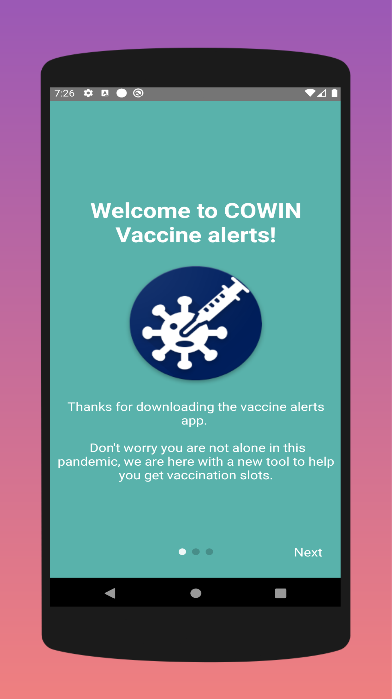
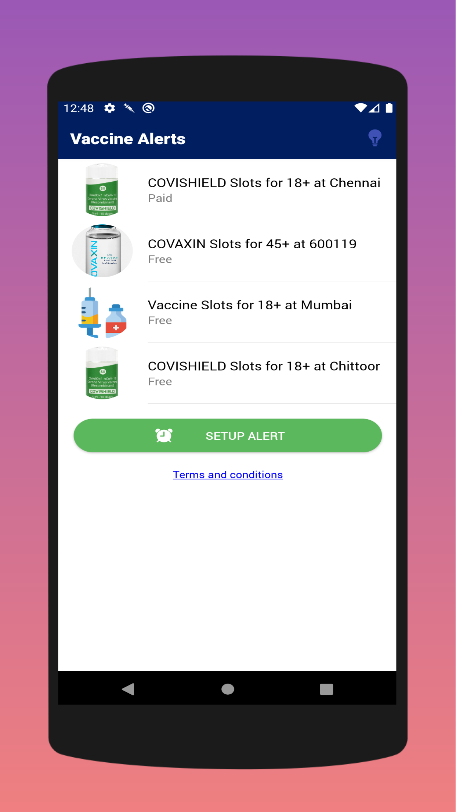
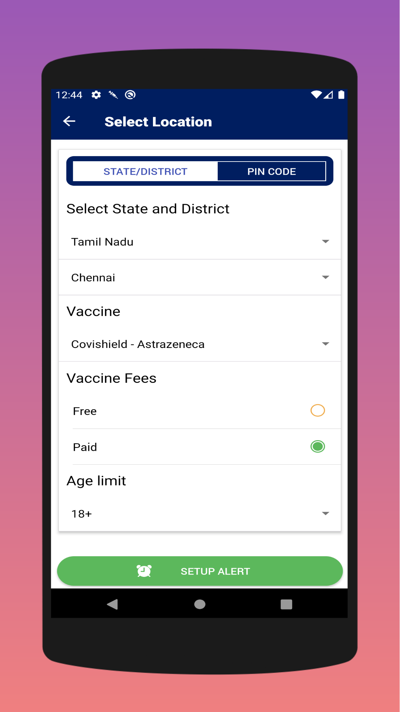
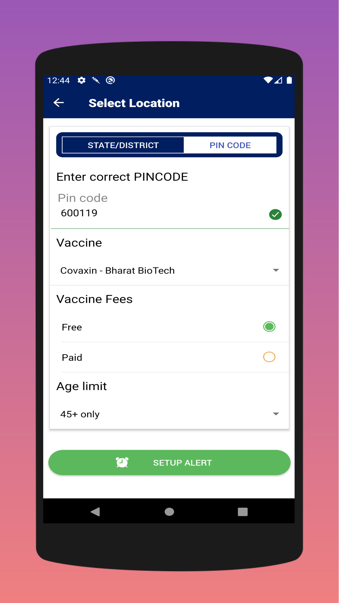
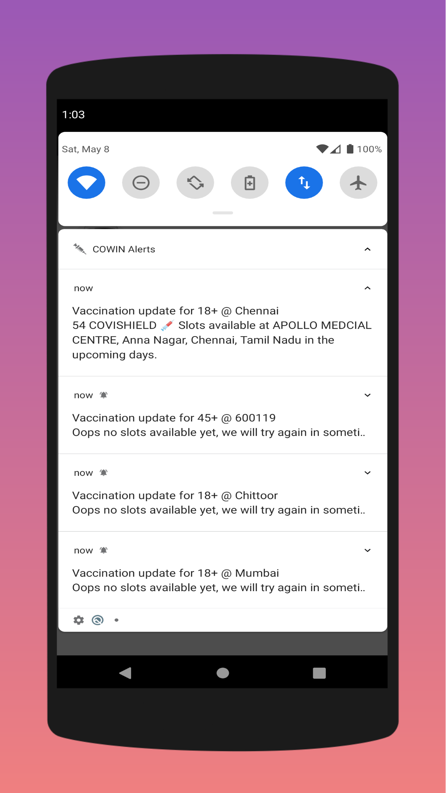
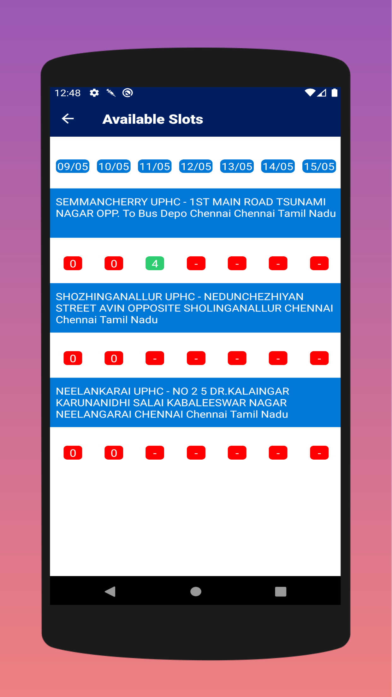

# CoWin Alerts
A mobile app to periodically fetch vaccine availability for a given location in India.

https://cowinalerts.app

## Tech stack:

React native + Typescript

## Screenshots:

### Welcome screen:

### Home screen:

### Add Alert:

### Add Alert PINCODE:

### Notifications:

### Available slots:

## Contributions:

Pull request to master branch.
